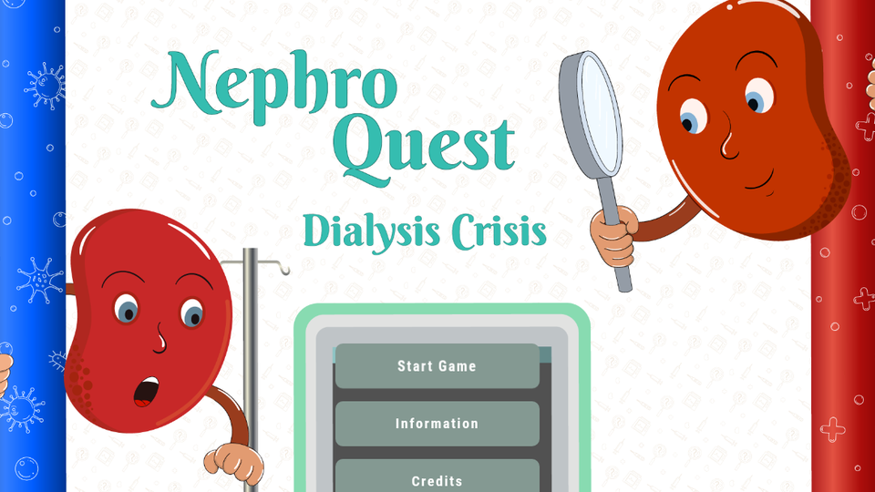

# NephroQuest

  

  <a href="https://nephlearngames.fun/"><strong>Live → nephlearngames.fun</strong></a>

  
  
  

**NephroQuest** is a dialysis educator game that teaches patients and caregivers through challenges — not long lectures.

Built for real people on dialysis in India and beyond. Live product with **1k+ users** and real payments.

## Who it is for

- Dialysis patients who learn better by playing
- Caregivers who need clear, bite-sized education
- Clinics that want an engaging teaching tool

## What it does

| Area | Detail |
|---|---|
| Gameplay | Dialysis challenge / quiz-style learning |
| Audience | Patients + caregivers |
| Business | Live payments on the product site |
| Reach | 1k+ users |

## Live

**[https://nephlearngames.fun/](https://nephlearngames.fun/)**

## SEO keywords

NephroQuest · dialysis game · dialysis education · kidney care learning · nephrology quiz · patient education India · dialysis challenge

## Note

This repo is the public home + marketing page for NephroQuest.
The live product runs at [nephlearngames.fun](https://nephlearngames.fun/).

## Author

[Sandesh Lanjewar](https://github.com/SandeshL702)
